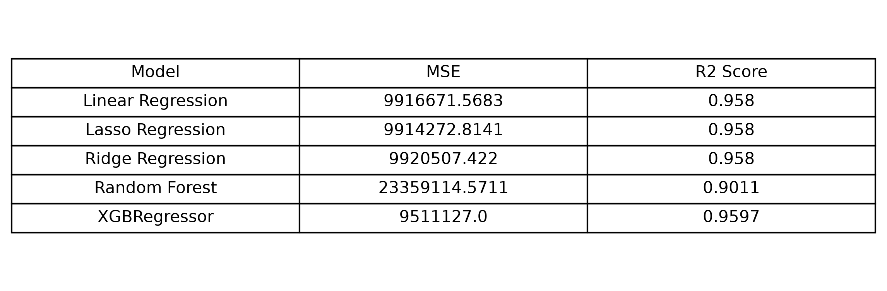
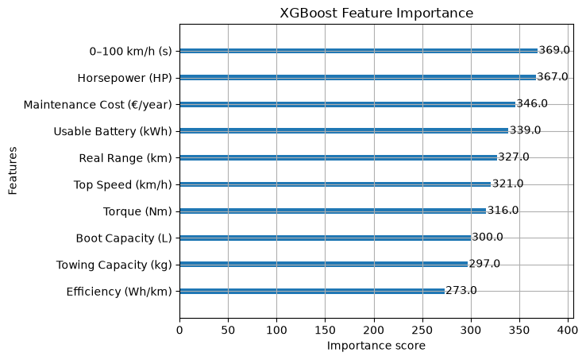
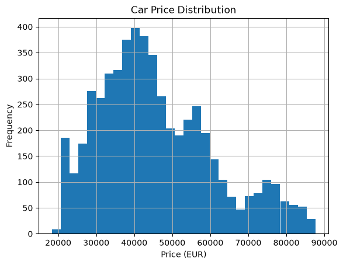

# Automotive-Price-Prediction-Market-Intelligence-System

## Overview
Built an end-to-end machine learning pipeline to predict European car prices using regression models.

## Technologies
Python, Pandas, NumPy, Scikit-learn, XGBoost, Matplotlib, Seaborn

## Dataset
European Cars Dataset from Kaggle:
https://www.kaggle.com/datasets/eswarpanchakarla/european-cars-dataset

## Project Structure
```text
Automotive-Price-Prediction-Market-Intelligence-System
│
├── images/
│    ├── model_comparison_mse.png
│    ├── model_comparison_r2.png
│    ├── model_comparison_table.png
│    ├── price_distribution.png
│    └── xgb_feature_importance.png
├── European-Automotive-Intelligence-System.ipynb
├── European_cars_dataset.xlsx
├── README.md
└── requirements.txt
```

## Workflow
```text
- Data loading
- Data cleaning and preprocessing:
       duplicate and missing value checks,
       outlier handling using IQR (Interquartile Range) method
- Feature engineering:
       domain-based feature creation,
       One-hot encoding
- Model building and training
- Model comparison
- Visualization
```

## Models Used
- Linear Regression
- Lasso Regression
- Ridge Regression
- Random Forest
- XGBoost

## Evaluation Metrics
- Mean Squared Error (MSE)
- Root Mean Squared Error (RMSE)
- R² Score

## Results
XGBoost achieved the best performance among the tested models.

### Model Comparison


### XGBoost Feature Importance


### Price Distribution


## Key Insights
Feature analysis showed that vehicle performance, efficiency, and safety-related features influence car pricing.
